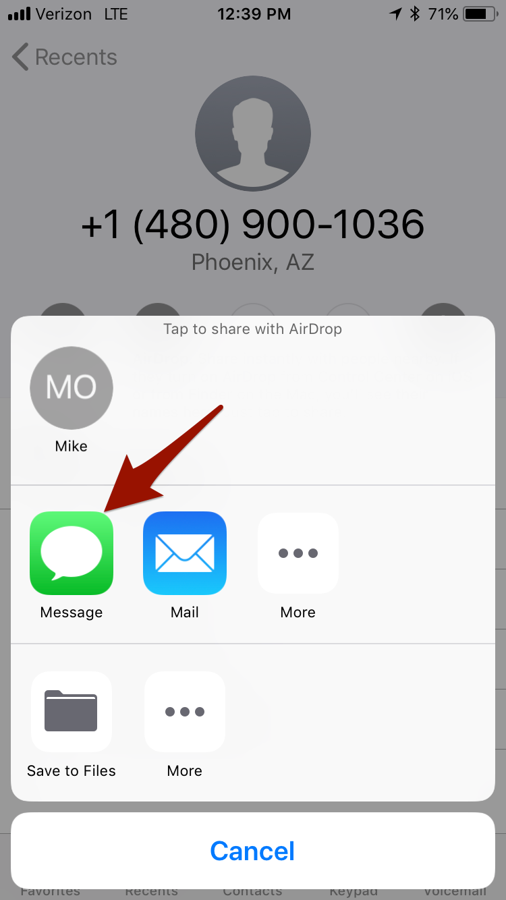

Don't you wish you could do something about the spam calls you receive? Well, donotcall.tel files complaints with the [National Do Not Call Registry](https://www.donotcall.gov/) via text messages.

The process is **free** and **simple** to use. Follow the steps to start filing complaints:

## Register your phone number with the Do Not Call registry

You need to register your phone number with the National Do Not Call Registry. The National Do Not Call Registry does not accept complaints to be filed unless your number has been registered for at least 31 days.

If you've already registered your number, you can continue.

If you're unsure whether your number is registered, you can [verify your registration](https://www.donotcall.gov/confirm/conf.aspx).

If you haven't registered, you can [register your phone](https://www.donotcall.gov/register/reg.aspx).

**Note: Please make sure to wait for 31 days before filing complaints.**

## Add the Do Not Call contact to your contacts

Download the [Do Not Call vCard](./donotcall.vcf) and add it to your contacts.

If that doesn't work, you can manually add the following phone number to your contacts:

**[(612) 260-8921](tel:16122608921)**

## Share the phone number with the Do Not Call service

There are multiple ways to file complaints for a phone number:

* Send text message with a single number (e.g. `612-123-1234`).
* Share contact (i.e. vCard) via text message.

The complaints are filed on behalf of your phone number when sending the text message. The date and time used to file the complaint is also based on your phone number and it's location. It's recommended to share the complaint phone number as soon as possible so the date and time filed with the complaint is close to when the actual call was received.

### Share contact via text message

The following are instructions to easily share the spam contact via text message:

#### iOS

* In your Recents call list, tap the (i) button

  

* At the bottom of the contact is a "Share Contact" button, click that

  

* Click "Message" to send via text message

  

* In the "To:", use the Do Not Call contact setup earlier and send

  

#### Android

**TBD**
